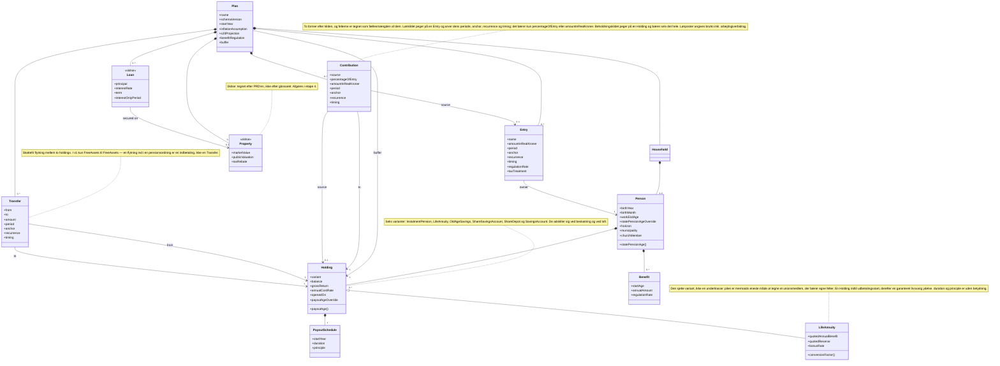

# Domænemodellen

Strukturen bag begreberne i [CONTEXT.md](../../CONTEXT.md). Navnene er de engelske identifiers fra glossaret — de er dem koden bruger.

Diagrammet viser **planens indhold**: det brugeren opretter og redigerer. Motorens output (`YearResult`) er bevidst holdt udenfor, fordi det er en projektion af planen, ikke en del af den.

## Hvad diagrammet gør krav på

- **`Holding` er én type med seks varianter, ikke seks typer.** De deler saldo, afkast og udbetalingsplan og adskiller sig i beskatning og i loft. Se [ADR-0003](../adr/0003-fast-afkast-pr-beholdning.md) for hvorfor afkastet er ét fast tal pr. beholdning.
- **`variant` er én akse, ikke to.** Beskatningen er ikke et selvstændigt felt ved siden af varianten, for så ville kombinationer, der ikke findes — en aldersopsparing beskattet som kapitalindkomst — skulle valideres frem for at være uskrivelige. Hele beholdningssiden af skattemotoren bliver dermed ét opslag:

  | Variant | Afkast | Hævning/udbetaling | I `TaperBase` | `Deductibility` | `Cap` |
  |---|---|---|---|---|---|
  | `InstalmentPension` | `HoldingTax`, PAL-satsen | personlig indkomst | ja | ja | `PerYear` |
  | `LifeAnnuity` | `HoldingTax`, PAL-satsen | personlig indkomst | ja | ja | intet ved arbejdsgiverordning |
  | `OldAgeSavings` | `HoldingTax`, PAL-satsen | skattefri | nej | nej | `PerYear`, med trappe |
  | `ShareSavingsAccount` | `HoldingTax`, aktiesparekontoens sats | skattefri | nej | nej | `OnBalance` |
  | `ShareDepot` | 27/42 % lager, fælles overførbar grænse | skattefri | ja | — | intet |
  | `SavingsAccount` | kapitalindkomst | skattefri | ja, kun når positiv | — | intet |

  `LifeAnnuity` deler `InstalmentPension`s beskatning fuldstændigt og har sin egen række alligevel, fordi loftet skiller dem, jf. [ADR-0015](../adr/0015-livrenten-er-en-sjette-variant-ikke-en-underklasse.md). Varianten hedder det, beholdningen er, og ikke det, dens afkast bliver til: et aktiedepot er ikke en aktieindkomst, jf. [ADR-0017](../adr/0017-beholdningen-hedder-hvad-den-er-ikke-hvad-dens-afkast-bliver-til.md). Hvilket felt afkastet lander i, står derfor i `simulate` og ikke i navnet.
- **`FreeAssets` er en kategori, ikke en variant.** Den dækker `ShareDepot` og `SavingsAccount` under ét, og det er den, buffer- og overførselsreglerne taler om. Aktiesparekontoen hører ikke med — den har et indskudsloft.
- **`PayoutSchedule` hænger på beholdningen, ikke på personen.** Det er dét, der gør motoren plan-drevet — se [ADR-0002](../adr/0002-plan-drevet-motor-med-frie-midler-som-buffer.md).
- **`payoutAge()` er afledt, ikke indtastet.** Den udledes af `openedOn` via udbetalingsregimet, med `payoutAgeOverride` til overførselstilfælde. Fordi to af de tre regimer er relative til folkepensionsalderen, ændrer den sig, når `Person.statePensionAge()` justeres.
- **`Person.statePensionAge()` er afledt efter samme mønster.** Den udledes af `birthYear` og `birthMonth` efter den lovfastsatte fødselsdatotabel i docs/satser/folkepensionsalder.md, med `statePensionAgeOverride` til de fødselsår, hvor tabellen kun har et fremskrevet skøn. Tabellen er ikke et `RateYear` — den ændrer sig ikke fra satsår til satsår, kun når Folketinget vedtager et nyt trin.
- **`Entry` er én figur for både indtægt og udgift.** Kun indtægtsposter bærer en `taxTreatment` og en `regulationRate`. En udgift har intet eget tempo og følger planens `inflationAssumption`, som en `Transfer` gør.
- **`LifeAnnuity` er en `Holding`, indtil den omsættes.** Den modtager indbetalinger og forrentes som alle andre beholdninger; ved udbetalingsstart ganges det fremskrevne depot med `conversionFactor()` og bliver til en fast livsvarig ydelse. Se [ADR-0009](../adr/0009-livrenten-omsaettes-en-gang-ved-udbetalingsstart.md).
- **`Contribution` er en bevægelse, ikke en udgift, og lønnen er brutto.** Alt andet knækker balanceinvarianten. Lofterne hænger på bidraget, ikke på lønnen, og derfor er det en selvstændig figur. Se [ADR-0007](../adr/0007-indbetalinger-er-bevaegelser-og-loennen-er-brutto.md).
- **`Contribution` er to former, delt af kilden.** Et lønkildet bidrag peger på sin `Entry` og arver dens periode, så det ophører af sig selv ved `workEndAge` og ikke kan komme ud af trit med lønnen; det bærer kun en procent eller et fast beløb. Et beholdningskildet bidrag har ingen lønpost at arve fra og bærer selv beløb, periode, gentagelse og forfald, som en `Transfer`. Det er den form, aldersopsparingens vindue efter erhvervsophør skrives i.
- **Skellet mellem `Contribution` og `Transfer` måles på destinationen.** En indbetaling går ind i en beholdning, der ikke er `FreeAssets`; en overførsel flytter mellem frie midler. Hverken skattevirkningen eller loftet kan bære skellet: aldersopsparingen har et `Cap` og ingen `Deductibility`.
- **`timing` er en afkastvægt, ikke et tidsskridt.** Jævnt fordelt giver vægt ½; en bestemt måned giver `(12 − N + 1) / 12`. Se [ADR-0006](../adr/0006-maaneden-er-en-afkastvaegt-ikke-et-tidsskridt.md).
- **`FreeAssets` ejes af en `Person`, ikke af husstanden, og bufferrollen er skilt ud.** Præcis én `Holding` pr. `Plan` er udpeget som `buffer` og absorberer årets restpost. Se [ADR-0004](../adr/0004-frie-midler-pr-person-med-udpeget-buffer.md).
- **`RateYear` er ikke med, og det er meningen.** Satser er delt referencedata; planen bærer kun fremskrivningsantagelserne. `YearResult` stempler hvilket satsgrundlag, det er regnet på. Se [ADR-0005](../adr/0005-satser-er-referencedata-planen-pinner-ikke.md).
- **`Transfer` er den eneste måde en ikke-buffer-`FreeAssets` kan bruges på.** Uden den ændrer den sig kun ved sit eget afkast. `Transfer` er ikke en `Entry`: to modgående poster ville nettes til nul på bufferen og flytte ingenting.

## Åbne punkter

- **`Property` og `Loan` er mærket `<<skitse>>`.** De er tegnet efter [hoved-PRD'en](https://github.com/jbhdk/PensionPlanner/issues/1), ikke efter glossaret, og deres termer afgøres først i etape 4 — ejendomsskattereformens rabatordning og dens bortfald ved salg er et hjørne, der skal grilles for sig. Mærket betyder: brug dem ikke som om de var afgjorte.
