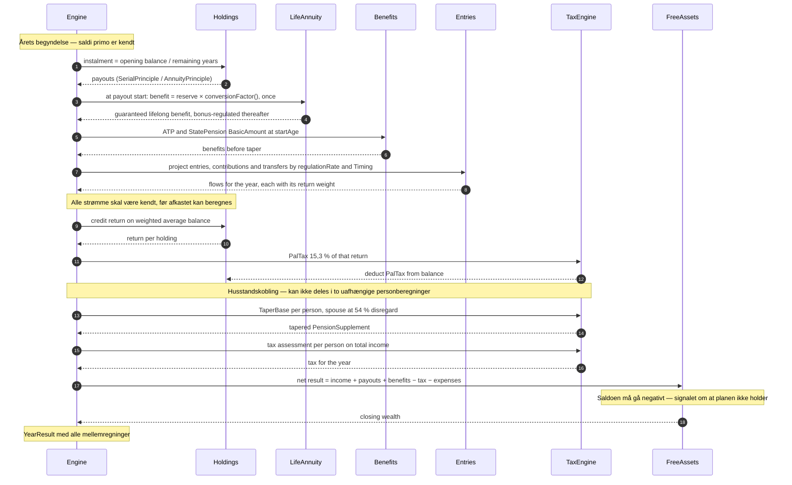

# Ét simuleringsår

Rækkefølgen inde i motoren for ét kalenderår. Alt herunder regnes i `Nominal` — deflateringen til `Real` sker først i brugerfladen, jf. [ADR-0001](../adr/0001-nominel-regning-real-visning.md).

Diagrammet er den mest omstridte del af designet: hvert trin læser resultatet af de foregående, og en ombytning ændrer tallene.

## Hvorfor rækkefølgen er som den er

- **Strømmene først, afkastet bagefter.** Afkastet regnes på den vægtede gennemsnitssaldo, så alle årets bevægelser og deres `timing` skal være kendt, før det kan beregnes. Se [ADR-0006](../adr/0006-maaneden-er-en-afkastvaegt-ikke-et-tidsskridt.md).
- **Raten regnes altid af primosaldoen.** Det er en lovregel — saldoen ved årets begyndelse divideret med resterende udbetalingsår — ikke en konvention, og den påvirkes derfor ikke af vægtningen.
- **PAL-skat af årets faktiske afkast.** Når afkastet er vægtet korrekt, er der ikke længere et spørgsmål om, hvad PAL rammer.
- **Aftrapning før skat.** `PensionSupplement` er skattepligtig indkomst, så det aftrappede beløb — ikke det fulde — skal ind i skatteopgørelsen.
- **`FreeAssets` til sidst.** Alt, der ikke er placeret et bestemt sted, lander her. Se [ADR-0002](../adr/0002-plan-drevet-motor-med-frie-midler-som-buffer.md).

## Åbne punkter

- **Balanceinvarianten skal kunne udtrykkes på dette diagram.** `closingWealth − openingWealth = income + return − tax − expenses − conversion` er den delte assertion i alle motortests; hvis et trin her ikke er synligt i den ligning, mangler diagrammet noget. `Conversion` mangler stadig som et synligt trin.
- **`Property` og `Loan` mangler.** Ejendomsværdiskat, grundskyld og låneydelsens split i renter og afdrag hører til etape 4 — men de skal ind i denne rækkefølge, ikke ved siden af den.
