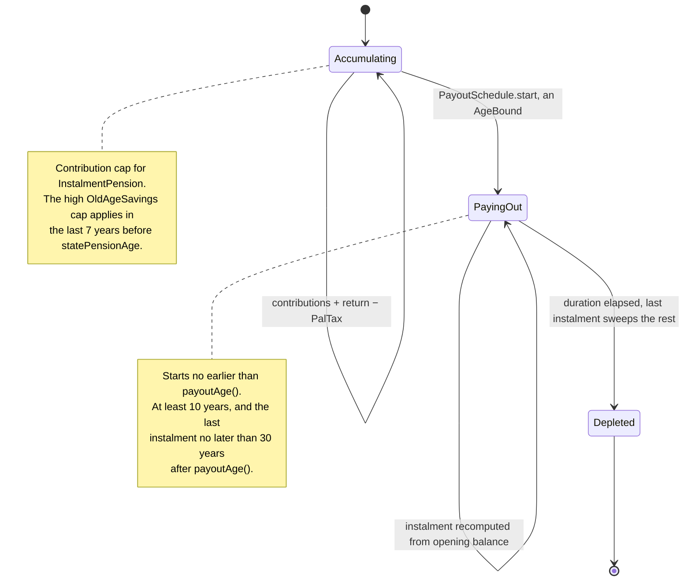
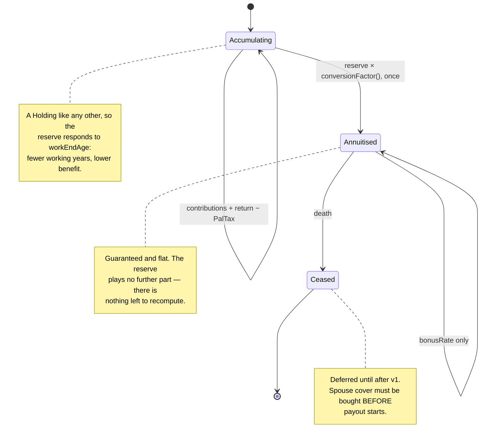
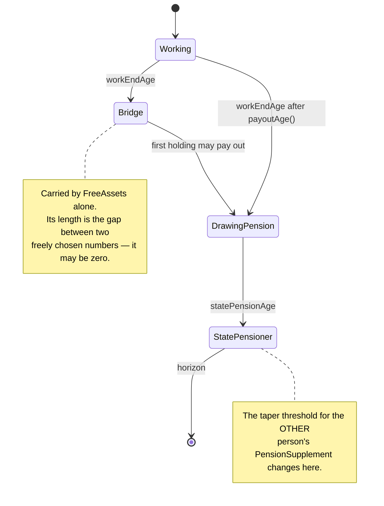

# Livscyklusser

Tre tilstandsmaskiner, der tilsammen forklarer, hvad "pensioneret" betyder i modellen. De er adskilte med vilje: `workEndAge`, en ordnings `payoutAge` og `statePensionAge` er tre uafhængige tidspunkter, og hele værktøjets pointe er afstanden mellem dem.

## `Holding`

Tilstandene gælder de to varianter, der har en `PayoutSchedule` — `InstalmentPension` her, `LifeAnnuity` nedenfor. En `OldAgeSavings` og en `ShareSavingsAccount` forlader aldrig `Accumulating`: de tømmes af en `Transfer`, jf. [ADR-0022](../adr/0022-den-skattefri-ordning-toemmes-af-en-overfoersel-ikke-af-en-udbetalingsplan.md), og saldoen falder uden at tilstanden skifter.

## `LifeAnnuity`

## `Person`

## Åbne punkter

- **`Bridge` kan mangle helt.** Ligger `workEndAge` efter første ordnings `payoutAge()`, findes fasen ikke. Brugerfladen skal sige noget fornuftigt frem for at vise en tom periode.
- **`Depleted` er ikke det samme som slettet.** En tømt ratepension skal blive stående i årstabellen med saldo nul, ellers knækker formuegrafens stablede areal. Saldoen bliver præcis nul, fordi den sidste rate fejer resten med efter afkast og beholdningsskat.
- **`Ceased` er den eneste tilstand, der afhænger af en anden persons tilstand.** Det er indgangen til efterladtescenariet.
- **Omsætningen er irreversibel.** Ændrer man `workEndAge` efter at have set resultatet, genberegnes hele forløbet — men inden for én kørsel sker omsætningen præcis én gang, jf. [ADR-0009](../adr/0009-livrenten-omsaettes-en-gang-ved-udbetalingsstart.md).
