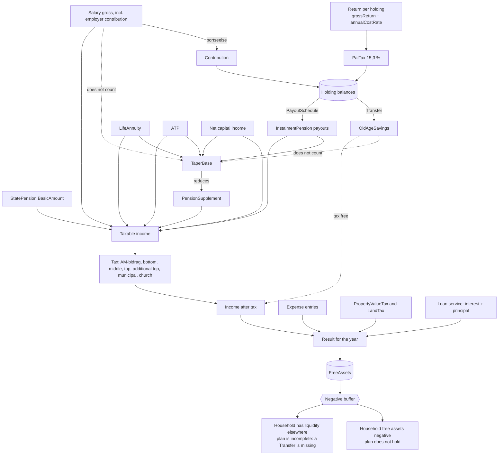

# Pengestrømmen i ét år

Vandfaldet fra bruttoindkomst til `FreeAssets`. Diagrammet svarer til trin 12–17 i [simuleringsåret](./02-simuleringsaaret.md), men set som penge frem for som kald.

Pointen er den nederste knude: **`FreeAssets` er restposten**. Ingen anden konto absorberer noget, og der er ingen regel, der forhindrer et negativt beløb. Se [ADR-0002](../adr/0002-plan-drevet-motor-med-frie-midler-som-buffer.md).

## Hvad diagrammet gør krav på

- **`OldAgeSavings` går uden om to ting på én gang:** den beskattes ikke ved udbetaling, og den tæller ikke med i `TaperBase`. Det er hele grunden til at have den som selvstændig variant — og grunden til, at den tømmes af en `Transfer` og ikke af en `PayoutSchedule`: uden skat på vejen ud er der ingen lovregel at binde en plan til, jf. [ADR-0022](../adr/0022-den-skattefri-ordning-toemmes-af-en-overfoersel-ikke-af-en-udbetalingsplan.md).
- **Arbejdsindkomst beskattes, men aftrapper ikke.** Derfor kan det betale sig at arbejde videre som folkepensionist, mens en ratepensionsudbetaling i samme år koster dobbelt.
- **En `Contribution` er en bevægelse, ikke en udgift.** Den forlader pengestrømmen og lander som saldo — bogført som udgift ville den tælles to gange og knække balanceinvarianten.
- **Afkastet er en sidesløjfe.** Det passerer aldrig gennem årets pengestrøm — det tilskrives saldoen og beskattes med PAL undervejs. Kun ved udbetaling bliver det til penge, husstanden kan bruge.

## Åbne punkter

- **Lagerbeskatningen af `FreeAssets` mangler som pil.** Skatten af årets urealiserede gevinst på frie midler og aktiesparekonto skal ind i vandfaldet — i dag ligger den implicit i `Tax`. Det haster mere nu, hvor aktieindkomsten er bekræftet at indgå i `TaperBase`, jf. [ADR-0010](../adr/0010-beskatningsformen-er-variantens-akse-og-indkomsten-foeres-pr-person.md).
- **Hvad forrenter en negativ saldo?** Stadig åbent. Uden en rente står et underskud stille. Det påvirker ikke søgningen efter tidligste holdbare `workEndAge`, jf. [ADR-0008](../adr/0008-holdbarhed-maales-paa-bufferen-alene.md), kun hvor slemt et fejlende forløb ser ud.
